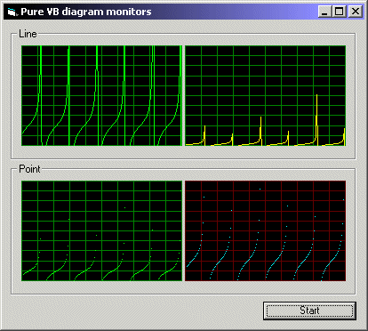



## Pure VB diagram monitors\!

### Description

Ever wanted to display graphical information about CPU, memory or any kind of variables? Check the screenshot and you'll know what I'm talking about. This PURE VISUAL BASIC made control adds graphical diagrams to your Visual Basic application very easily!! Just under 10 lines of code, and you have very cool graphical diagram monitoring your variables! All colors can be set easily. Also includes many other options to fit your app. Is you find this useful, please vote me or give me feedback.
 
### More Info
 

             |
---                |---
**Submitted On**   |2001-01-22 19:19:34
**By**             |[Sami Riihilahti](https://github.com/Planet-Source-Code/PSCIndex/blob/master/ByAuthor/sami-riihilahti.md)
**Level**          |Advanced
**User Rating**    |4.8 (57 globes from 12 users)
**Compatibility**  |VB 4\.0 \(32\-bit\), VB 5\.0, VB 6\.0
**Category**       |[Custom Controls/ Forms/  Menus](https://github.com/Planet-Source-Code/PSCIndex/blob/master/ByCategory/custom-controls-forms-menus__1-4.md)
**World**          |[Visual Basic](https://github.com/Planet-Source-Code/PSCIndex/blob/master/ByWorld/visual-basic.md)
**Archive File**   |[CODE\_UPLOAD140441222001\.zip](https://github.com/Planet-Source-Code/sami-riihilahti-pure-vb-diagram-monitors__1-14620/archive/master.zip)

